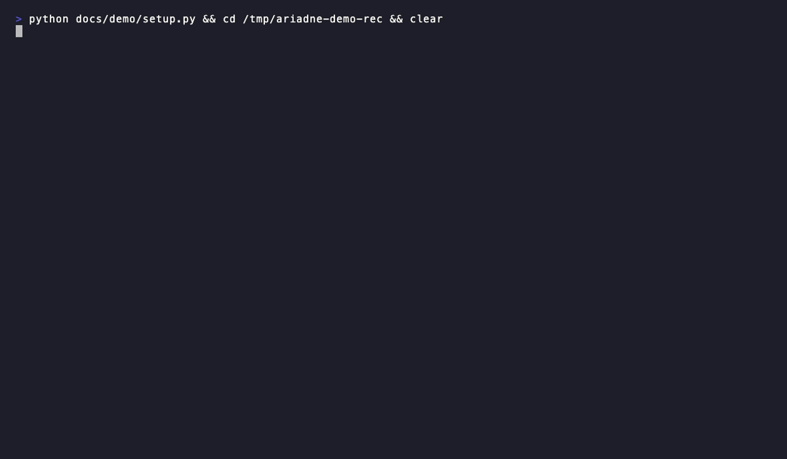

# Ariadne

[](LICENSE)
[](https://modelcontextprotocol.io)
[](https://glama.ai/mcp/servers/whyy9527/ariadne)
[](https://github.com/punkpeye/awesome-mcp-servers#-developer-tools)

> Ariadne's thread — a way out of the microservice maze.

Cross-service API dependency graph for Spring Boot + TypeScript
microservice stacks. MCP stdio server for AI coding assistants
(Claude Code, Cursor, Windsurf), with a CLI twin. Local SQLite + TF-IDF.
Zero ML dependencies.



---

## What it does

Indexes the *contract layer* — GraphQL mutations, REST endpoints, Kafka
topics, frontend queries. Nothing else. That's why results fit an AI
context window.

Ask Claude *"where does createOrder live across the stack?"* and
`query_chains` returns:

```
Top Cluster #1  [confidence: 0.91]
  Services: gateway, orders-svc, billing-svc, web
  - [web]          Frontend Mutation: createOrder
  - [gateway]      GraphQL Mutation:  createOrder
  - [orders-svc]   HTTP POST /orders: createOrder
  - [orders-svc]   Kafka Topic:       order-created
  - [billing-svc]  Kafka Listener:    order-created → chargeCustomer
```

~500 tokens round-trip. The equivalent `grep -r createOrder` across
four repos returns 40+ matches across DTOs, tests, and configs at
~2000 tokens, with the contract layer buried.

Supports: GraphQL · Spring HTTP/Kafka/RestClient · TypeScript
Apollo/fetch/axios · Cube.js.

---

## Install

```bash
git clone https://github.com/whyy9527/ariadne.git && cd ariadne
pip install mcp
cp ariadne.config.example.json ariadne.config.json   # edit repos inside
python3 main.py install ariadne.config.json ~/your-workspace
```

Restart Claude Code. `install` is idempotent — re-run after pulling new
code, or let the assistant call `rescan` on a `stale_warning`.

---

## Config

```json
{ "repos": [
    { "path": "../gateway" },
    { "path": "../orders-svc" },
    { "path": "../web" }
]}
```

Scanners are inferred from each repo's top-level files
(`pom.xml` / `build.gradle` / `package.json` / SDL). See
[`docs/CONFIG.md`](docs/CONFIG.md) for the detection table and override
syntax.

---

## Try it on a public sample

[`examples/spring-petclinic/`](examples/spring-petclinic/) — clone the
public `spring-petclinic-microservices` sample, drop in the config,
scan, query. Reproducible end-to-end in under a minute.

---

<sub>Architecture, MCP tools, scoring math, feedback boost →
[`docs/ARCHITECTURE.md`](docs/ARCHITECTURE.md). Custom scanners (Go,
Rust, anything) → [`docs/CUSTOM_SCANNERS.md`](docs/CUSTOM_SCANNERS.md).</sub>
