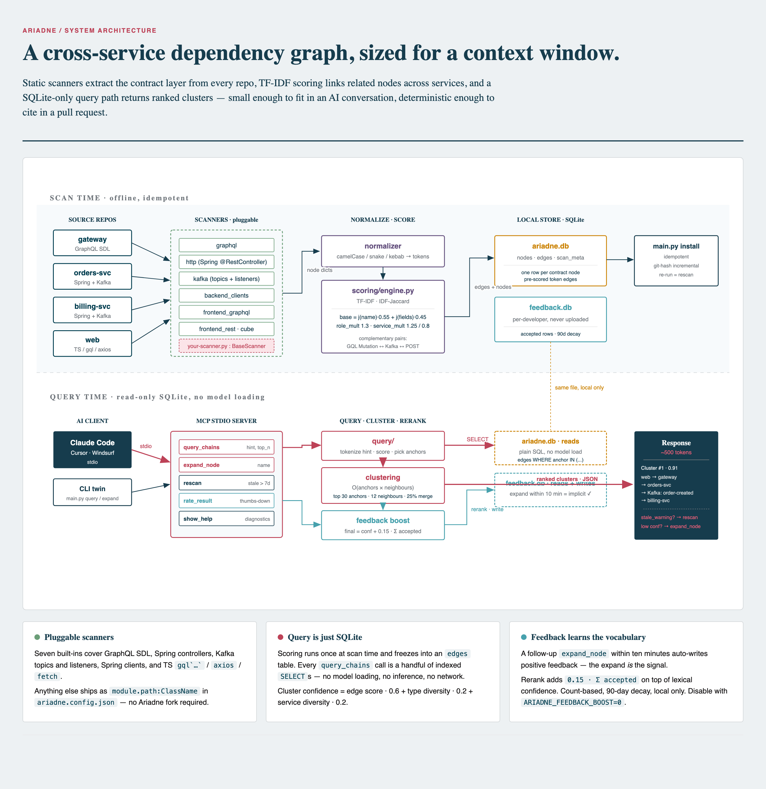

# Architecture

How Ariadne produces cross-service clusters from source code.



<sub>Brand tokens from
[VoltAgent/awesome-design-md](https://github.com/VoltAgent/awesome-design-md),
rendered via
[Cocoon-AI/architecture-diagram-generator](https://github.com/Cocoon-AI/architecture-diagram-generator).</sub>

## Layout

```
ariadne/
├── scanner/       # per-framework extractors → node dicts
├── normalizer/    # camelCase/snake/kebab → tokens
├── scoring/
│   └── engine.py  # TF-IDF + IDF-Jaccard → token edges
├── store/         # SQLite: ariadne.db / feedback.db
├── query/         # query / expand — pure SQLite reads
├── evaluation.py  # JSONL judgments → hit rate / MRR
├── mcp_server.py  # MCP stdio server
├── main.py        # CLI + scan orchestration
└── tests/         # pytest suite
```

## Scoring

Token-based scoring runs at scan time and populates the `edges` table.
Query time reads edges via plain SQLite — no model loading, no inference.

### Token edges (`scoring/engine.py`)

Information retrieval on tokenized node names. `createOrder` →
`["create", "order"]`, compared via IDF-weighted Jaccard:

```
idf_jaccard(A, B) = Σ idf(t)  (t ∈ A ∩ B)  /  Σ idf(t)  (t ∈ A ∪ B)
idf(t)            = log(N / df(t))
```

Rare tokens dominate; high-frequency domain words (`task`, `id`, `service`)
self-dampen, no stopword list needed.

```
base  = idf_jaccard(name) * 0.55 + idf_jaccard(fields) * 0.45
token_total = min(base * role_mult * service_mult, 1.0)

role_mult    = 1.3   for complementary pairs
                     (GraphQL Mutation ↔ Kafka topic ↔ HTTP POST,
                      GraphQL Query ↔ Cube Query ↔ HTTP GET)
service_mult = 1.25  cross-service / 0.8 same-service
```

The "different names, same concept" problem
(`assignHomework` ↔ `assignStudentsToTask`) is handled by the feedback
boost below — no embeddings needed.

## Clustering

Two-stage, `O(anchors × neighbours)`, independent of repo count.

1. Tokenize the hint, score against all nodes, keep the top 30 anchors
   with `score ≥ 0.15`.
2. For each anchor, pull its edges from the DB (single `IN` query) and
   keep the top 12 neighbours with `edge_score ≥ 0.25`.
3. Merge anchor neighbourhoods that overlap by ≥ 25%.
4. Per cluster, take top 2 nodes per `(service, type)`, capped at 12.
5. `confidence = mean_edge_score · 0.6 + type_diversity · 0.2 + service_diversity · 0.2`

## Feedback boost

A final rerank step that adapts ranking to your team's vocabulary — no
model training, no uploads. `feedback.db` is local per developer.

Every `query_chains` call caches returned clusters for 10 minutes. A
follow-up `expand_node(name)` that substring-matches a node in a pending
cluster auto-writes an `accepted=True` row with that cluster's node ids —
the expand IS the signal.
`rate_result(hint, accepted, ...)` is the manual escape hatch for
thumbs-down. If `node_ids` is omitted, a recent `hint + cluster_rank`
match fills them from the pending query cache.

On the next `query()` for the same hint:

```
final_score =
  confidence
  + 0.15 * sum(prior_accepted_count per node in cluster)
  - 0.10 * sum(prior_rejected_count per node in cluster)
```

Weight (`0.15`) and decay window (`90 days`) are intentionally
conservative; rejected feedback is even lighter (`0.10`) to avoid overfitting
one bad interaction. Lexical confidence still dominates. Disable with
`export ARIADNE_FEEDBACK_BOOST=0`.

Day-one results are pure lexical ranking; after a few weeks they reflect
your team's navigation patterns. Count-based, not a learned model.

## Evaluation

`ariadne-mcp eval <judgments.jsonl>` is the offline ranking gate. Each
judgment names a query hint and the node ids that should appear in a top-k
cluster:

```json
{"hint":"createOrder","expected_node_ids":["gateway::gql::m::createOrder"],"k":3}
```

The evaluator reuses the same `query()` path as the CLI/MCP server, then
computes:

- `hit_rate`: fraction of judgments where a matching cluster appears in top-k.
- `MRR`: mean reciprocal rank of the first matching cluster.

By default a judgment is satisfied when any expected node id appears in a
cluster. Set `"match": "all"` when all expected node ids must appear in the
same cluster. CI can pass `--min-hit-rate` and `--min-mrr` to turn regressions
into a non-zero exit code.

## MCP tools

What an AI assistant sees once `install` is done:

| Tool           | Args                                  | Purpose                                |
|----------------|---------------------------------------|----------------------------------------|
| `query_chains` | `hint`, `top_n` (default 3)           | Business term → cross-service clusters |
| `expand_node`  | `name` (partial match supported)      | One-hop neighbours of a known node     |
| `rescan`       | *(none)*                              | Refresh the index in place; git-hash incremental |
| `show_help`    | *(none)*                              | Setup guide + runtime config diagnostics |
| `rate_result`  | `hint`, `accepted`, `cluster_rank`, `node_ids` | Manual feedback; can infer node ids from recent `query_chains` |

## Re-scan trigger

If the oldest scan is > 7 days old, MCP responses include a
`stale_warning` field (CLI prints the same warning to stderr). From an
AI conversation, call `rescan()`; from the shell,
`ariadne-mcp scan --config <path>`.
